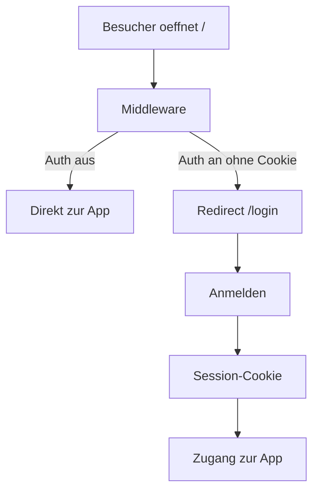

# Zugangsschutz auf Vercel aktivieren

Die Login-Maske erscheint nur, wenn **alle drei** Umgebungsvariablen auf Vercel gesetzt sind und ein **Redeploy** gelaufen ist.

## 1. Status prüfen

Im Browser (Production-URL):

```text
https://IHRE-DOMAIN.vercel.app/api/auth/status
```

Erwartung bei aktivem Login:

```json
{ "enabled": true, "reason": null }
```

Lokal oder mit Remote-URL:

```bash
npm run check:auth
npm run check:auth -- https://ihre-domain.vercel.app
```

## 2. Variablen in Vercel setzen

**Vercel Dashboard** → Projekt → **Settings** → **Environment Variables**

| Variable | Pflicht | Hinweis |
|----------|---------|---------|
| `AUTH_USERNAME` | Ja | Login-Benutzername |
| `AUTH_PASSWORD` | Ja | Login-Passwort |
| `AUTH_SECRET` | Ja | Mind. **32 Zeichen**, zufällig |

`AUTH_SECRET` erzeugen:

```bash
node -e "console.log(require('crypto').randomBytes(32).toString('hex'))"
```

**Wichtig:**

- Kein Leerzeichen um das `=`
- Für **Production** aktivieren (ggf. auch **Preview**)
- `.env.local` wird **nicht** automatisch nach Vercel übernommen

Optional weiterhin:

- `GROK_API_KEY` für die KI-Analyse

## 3. Redeploy

Nach dem Speichern der Variablen:

- **Deployments** → letztes Deployment → **Redeploy**

oder neuen Commit auf `main` pushen.

## 4. Test

1. `/api/auth/status` → `"enabled": true`
2. `/` im Inkognito-Fenster → Redirect auf `/login`
3. Anmeldung mit `AUTH_USERNAME` / `AUTH_PASSWORD`
4. Button **Abmelden** in der Kopfzeile sichtbar

## Fehlercodes (`reason`)

| reason | Bedeutung |
|--------|-----------|
| `not_configured` | Keine AUTH-Variablen gesetzt |
| `incomplete` | Nur ein Teil der drei Variablen gesetzt |
| `secret_too_short` | `AUTH_SECRET` kürzer als 32 Zeichen |

## Ablauf (Auth aktiv)


